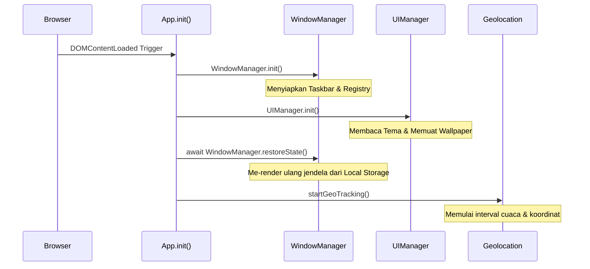
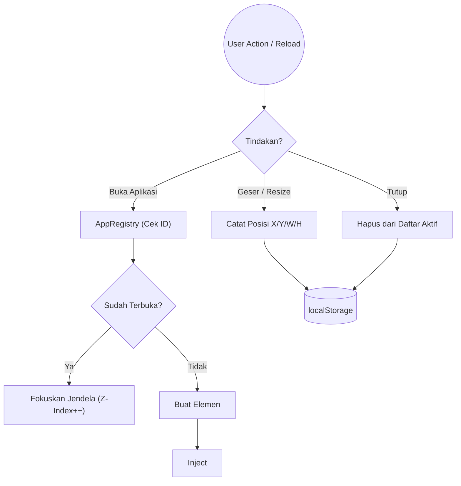
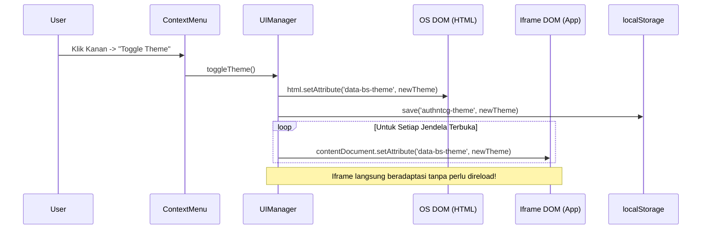
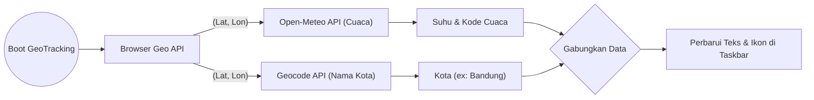

# Arsitektur Sistem dan Modul JS (Core Services)

Dokumen ini membedah arsitektur inti dari *Web OS* yang beroperasi pada `script.js`. Pendekatan yang digunakan adalah *Vanilla JavaScript Module Pattern* yang ringan dan cepat.

---

## 1. App (Main Controller)

Modul `App` adalah "otak pertama" yang terbangun saat halaman dimuat. Tugasnya adalah mengorkestrasi urutan *booting* berbagai subsistem agar tidak terjadi *race condition*.

**Detail Alur Kerja:**
1. **Inisialisasi Dasar**: `window.AppZIndex` di-set di angka 100 sebagai titik awal penumpukan jendela (Z-Index).
2. **Sinkronisasi Subsistem**: Menunggu subsistem UI (`UIManager.init()`) selesai memuat *background* berat sebelum memaksa OS me-render jendela (`restoreState`).
3. **Layanan Latar Belakang**: Menjalankan *GeoTracking* yang akan berjalan di *background* setiap beberapa menit.

---

## 2. WindowManager & AppRegistry

`WindowManager` adalah jantung OS yang mengatur *lifecycle* seluruh aplikasi jendela (membuat, menghancurkan, meminimalkan).

**Detail Sub-Komponen:**
- **Iframe Isolation**: OS ini telah bermigrasi dari injeksi teks HTML (`innerHTML`) menjadi pembungkusan *Iframe* absolut. Artinya, ketika `WindowManager` membuka `project/qr-code-generator/index.html`, ia membuat alam semesta baru yang terisolasi untuk aplikasi tersebut, sehingga variabel dan CSS tidak saling merusak.
- **State Persistence (Memori Jendela)**: Setiap kali jendela disentuh (`mouseup`) atau dihancurkan, fungsi `saveState()` dipanggil untuk mencetak *blueprint* jendela saat itu ke dalam memori peramban (`localStorage`). Saat di-*refresh*, fungsi `restoreState()` akan meleret *blueprint* tersebut dan memanggil `AppRegistry` untuk me-render ulang.

---

## 3. UIManager & Global Theme Sync

Bertanggung jawab atas estetika, *Clock*, *Dynamic Wallpaper*, dan Tema.

**Detail Alur Kerja Tema:**
Karena aplikasi berjalan di dalam *Iframe*, mereka secara bawaan terputus dari OS Induk. UIManager memiliki fungsi *Cross-Dimensional Mutator* yang akan menelusuri DOM setiap *iframe* yang sedang terbuka, lalu memaksa *tag html* mereka untuk mengikuti tema *Dark/Light* secara instan.

---

## 4. DesktopUI & WeatherService

Mengontrol antarmuka statis OS seperti Start Menu, Jam, dan Cuaca.

**Detail Fungsionalitas:**
- Layanan cuaca (WeatherService) berjalan secara *asynchronous* paralel. Ini mencegah peramban *freeze* saat menunggu balasan dari server cuaca Eropa. Jika gagal, OS menggunakan *graceful degradation* dengan hanya menampilkan tulisan "Offline" tanpa memunculkan error *crash* di konsol.
