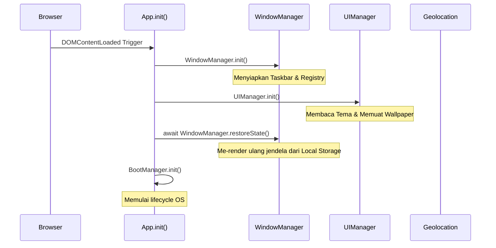
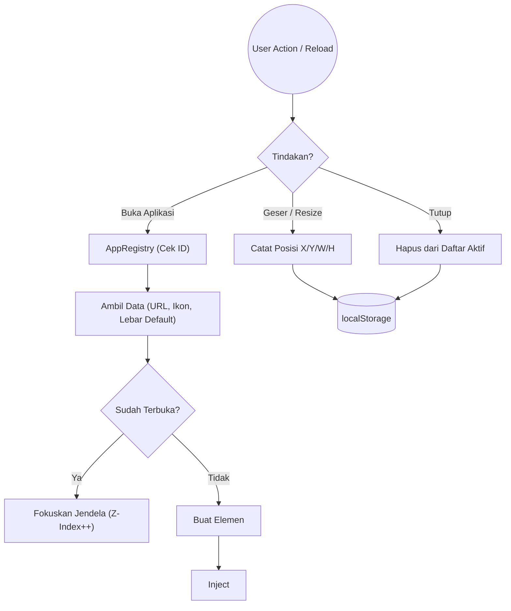
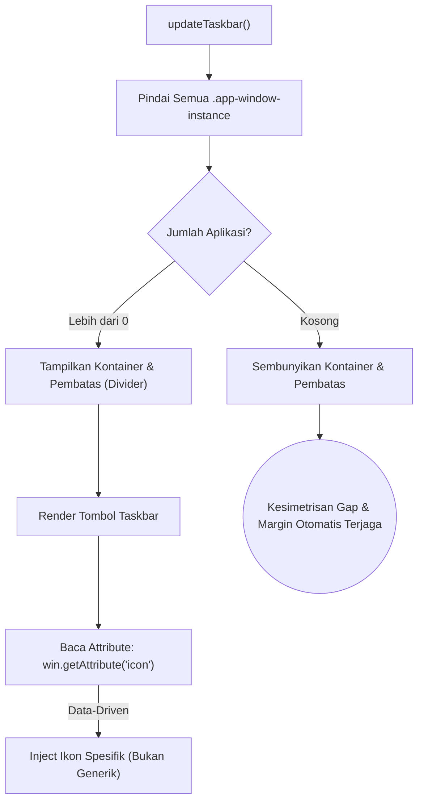
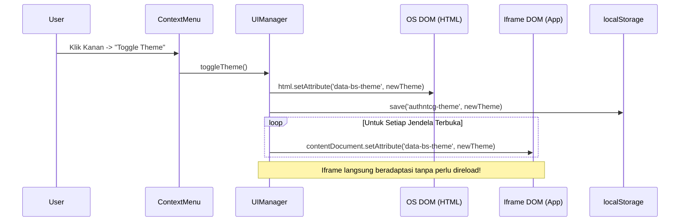
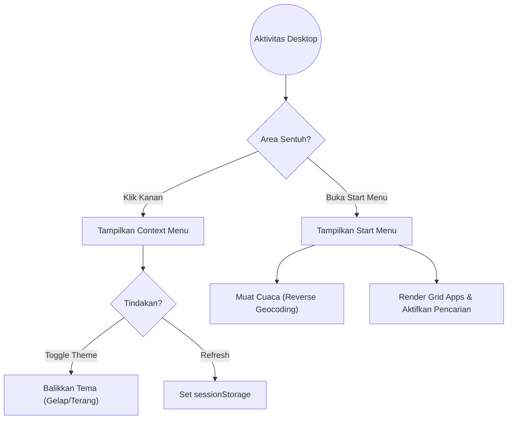
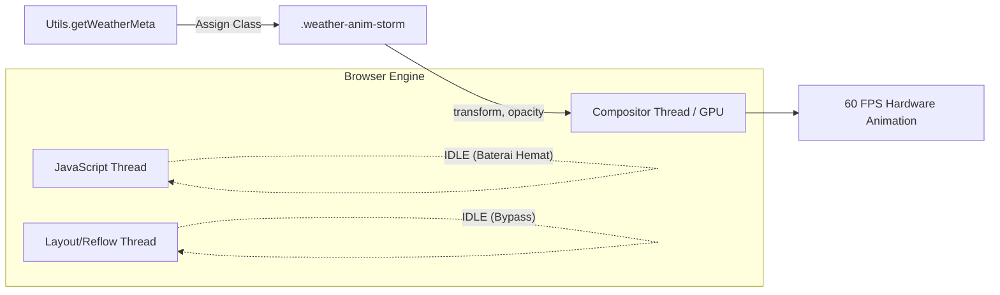
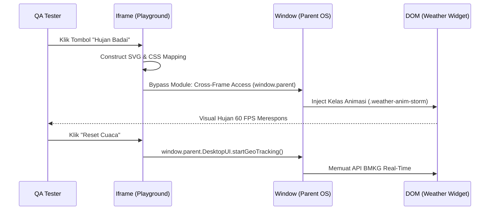

# Arsitektur Sistem dan Modul JS (Core Services)

Dokumen ini membedah arsitektur inti dari *Web OS* yang beroperasi pada `script.js`. Pendekatan yang digunakan adalah *Vanilla JavaScript Module Pattern* yang ringan dan cepat.

---

## 1. App (Main Controller)

Modul `App` adalah "otak pertama" yang terbangun saat halaman dimuat. Tugasnya adalah mengorkestrasi urutan *booting* berbagai subsistem agar tidak terjadi *race condition*.

**Detail Alur Kerja:**
1. **Inisialisasi Dasar**: `window.AppZIndex` di-set di angka 100 sebagai titik awal penumpukan jendela (Z-Index).
2. **Sinkronisasi Subsistem**: Menunggu subsistem UI (`UIManager.init()`) selesai memuat *background* berat sebelum memaksa OS me-render jendela (`restoreState`).
3. **OS Lifecycle**: Menyerahkan siklus OS ke BootManager.

---

## 2. WindowManager & AppRegistry

`WindowManager` adalah jantung OS yang mengatur *lifecycle* seluruh aplikasi jendela (membuat, menghancurkan, meminimalkan).

**Detail Sub-Komponen:**
- **Iframe Isolation**: OS ini telah bermigrasi dari injeksi teks HTML (`innerHTML`) menjadi pembungkusan *Iframe* absolut. Artinya, ketika `WindowManager` membuka `project/qr-code-generator/index.html`, ia membuat alam semesta baru yang terisolasi untuk aplikasi tersebut, sehingga variabel dan CSS tidak saling merusak.
- **State Persistence (Memori Jendela)**: Setiap kali jendela disentuh (`mouseup`) atau dihancurkan, fungsi `saveState()` dipanggil untuk mencetak *blueprint* jendela saat itu ke dalam memori peramban (`localStorage`). Saat di-*refresh*, fungsi `restoreState()` akan meleret *blueprint* tersebut dan memanggil `openApp()` yang secara otomatis menyuntikkan ulang atribut `icon` dan dimensi jendela berdasarkan `AppRegistry` tanpa perlu redundansi hardcode.

---

## 3. Dynamic Taskbar & Start Menu

Taskbar bukan lagi komponen pasif, melainkan pengamat jendela dinamis yang sangat efisien secara matematis.

**Detail Sub-Komponen:**
- **AppRegistry Metadata**: Untuk menghilangkan inkonsistensi, deklarasi aplikasi direfaktor menggunakan prinsip *Clean Code (DRY)*. Data krusial seperti tipe ikon (ex: `fluent:settings-24-regular`) disimpan di `AppRegistry`, dikirim ke parameter jendela saat pemanggilan, dan dibaca ulang secara leksikal oleh Taskbar.
- **Symmetry Gap Enforcement**: Menggunakan perhitungan CSS dan Flexbox cerdas, jika Taskbar dinamis disembunyikan (`display: none`), properti `gap-2` pada Flex parent secara matematis mengunci posisi Start Menu secara sempurna tanpa menyisakan ruang kosong (Empty Space) di kiri-kanan layar.

---

## 4. UIManager & Global Theme Sync

Bertanggung jawab atas estetika, *Clock*, *Dynamic Wallpaper*, dan Tema.

**Detail Alur Kerja Tema:**
Karena aplikasi berjalan di dalam *Iframe*, mereka secara bawaan terputus dari OS Induk. UIManager memiliki fungsi *Cross-Dimensional Mutator* yang akan menelusuri DOM setiap *iframe* yang sedang terbuka, lalu memaksa *tag html* mereka untuk mengikuti tema *Dark/Light* secara instan.

**Robust Dynamic Background (Sistem Anti-Lumpuh):**
Fungsi `initDynamicBackground()` melakukan pemanggilan gambar berbasis janji (*Promise*) ke API luar (seperti `picsum.photos`). Jika API gagal atau koneksi jaringan putus, fungsi `img.onerror` akan segera membatalkan pemuatan dan memberikan *Fallback Color* (Warna Dasar Aman seperti `#1a1a2e`) untuk mencegah layar *blank*.

---

## 5. DesktopUI & Context Menu

Mengontrol antarmuka statis OS seperti Start Menu, Jam Taskbar, Klik Kanan, dan Power Menu.

**Detail Fungsionalitas & Start Menu Revamp (Fase 8):**
- **Refresh Desktop Aman**: OS mengenali *refresh* yang disengaja melalui Context Menu dengan menyuntikkan sesi sementara, melewati *boot screen* untuk langsung kembali ke Desktop.
- **Glassmorphism & Simetri UI**: Start menu didesain menggunakan paradigma UI modern (Tailwind `backdrop-blur`, Flexbox `flex-1`), menampilkan grid aplikasi dan Widget sekilas secara simetris.
- **Real-Time App Filtering**: Kotak pencarian (Search Input) kini memiliki *event listener* yang langsung memfilter aplikasi ter-pin (Pinned Apps) secara dinamis tanpa *re-render* DOM (manipulasi `display`).
- **Integrasi Reverse Geocoding & OpenMeteo**: Logika Cuaca yang sebelumnya dihapus, kini direintegrasi ulang secara modular ke dalam `DesktopUI.fetchAndRenderWeather`. Logika ini menembak API `bigdatacloud.net` untuk menerjemahkan `latitude/longitude` menjadi nama Kota/Wilayah sesungguhnya (Reverse Geocoding), yang digabungkan dengan ikon cuaca `fluent-filled` dari data OpenMeteo.

---

## 6. BootManager & OS Lifecycle

Sistem operasi web ini tidak hanya sekadar menampilkan antarmuka statis, melainkan memiliki siklus hidup (*Lifecycle*) mutlak yang dikendalikan oleh BootManager.

`mermaid
stateDiagram-v2
    [*] --> Init: Pemuatan Halaman
    
    state Init {
        CheckMemori: Cek localStorage('authntcg-booted')
    }
    
    Init --> Booting: Memori Kosong (Boot Pertama)
    Init --> Lockscreen: Memori Terisi (Refresh)
    
    state Booting {
        Terminal: Animasi Mesin Ketik CMD
        Modern: Logo & Loading Spinner
        Terminal --> Modern: Selesai Log Kernel
    }
    
    Booting --> Lockscreen: Simpan Memori
    
    state Lockscreen {
        Wait: Menunggu Interaksi (Sign In)
    }
    
    Lockscreen --> Desktop: Klik 'Sign In' (Slide Up)
    Desktop --> PowerMenu: Klik Tombol Power
    
    state PowerMenu {
        Restart: Hapus Memori & Muat Ulang Layar
        Shutdown: Hapus Memori & window.close()
    }
`

**Detail Alur Kerja Siklus Hidup:**
1. **FOUC Prevention (Anti-Glitch)**: Sebuah *inline script* diletakkan pada titik tertinggi HTML untuk langsung membentangkan *overlay* Booting atau Lockscreen sebelum CSS selesai diproses peramban. Hal ini mencegah terjadinya kilatan putih (Flash of Unstyled Content).
2. **Terminal Typewriter Engine**: Sistem menggunakan setTimeout bertingkat untuk menyimulasikan kecepatan ketikan manusia yang disusul oleh mutahan data kernel baris per baris. Semuanya dikawal oleh kursor Consolas yang berkedip.
3. **Graceful Shutdown Fallback**: Jika pengguna menekan "Shutdown" namun window.close() dihentikan oleh peramban modern, layar tidak akan macet, melainkan berganti menjadi gaya retro aman: *"It is now safe to close your browser"*.
---

## 7. Strategi Animasi Micro-Interactions (Hardware Accelerated)

Berbeda dengan antarmuka web konvensional yang kerap menggunakan `requestAnimationFrame` atau elemen `<canvas>` untuk memicu animasi kompleks (seperti partikel hujan atau pergerakan awan), OS ini mengadopsi prinsip **Zero-JS GPU Compositing**.

**Konsep Utama:**
- **Zero DOM Clutter**: Semua elemen partikel digambar murni dari *string* SVG yang disisipkan ke dalam `background-image` pseudo-elemen CSS (`::before` / `::after`).
- **GPU Offloading**: Seluruh animasi memanipulasi properti fisik seperti `transform` (misal: `translateY`, `rotate`) dan `opacity`. Modern browser mendelegasikan animasi kedua properti ini langsung ke unit pengolah grafis (GPU), membiarkan utas utama JavaScript (Main Thread) tetap kosong untuk menangani komputasi AI (*Object Detection*).

---

## 8. Cross-Frame Quality Assurance (QA Playground)

Untuk mendukung siklus iterasi yang cepat tanpa harus melakukan intervensi manual pada kode sumber (seperti *mocking API*), disediakan aplikasi bawaan **Weather Simulator (QA Playground)** (`tools/dev-playground/index.html`).

**Pola Komunikasi Iframe-ke-OS:**
Karena skrip internal OS berjalan dalam lingkup *ES6 Modules* tertutup (`<script type="module">`), modul utilitas OS (`Utils`) terblokir dari *Iframe*. Sandbox ini diatasi dengan:
1. **Logika Otonom**: Simulator menduplikasi struktur data (*state*) ke dalam memorinya sendiri (bukan mengandalkan `window.parent.Utils`).
2. **DOM Hijacking**: Skrip Simulator memanjat hierarki DOM menggunakan `window.parent.document` untuk memanipulasi CSS OS secara sepihak.
3. **Public Hooks**: Menggunakan antarmuka publik yang sah (`window.parent.DesktopUI`) saat perlu memicu tindakan asinkronus kompleks seperti reset GPS.
