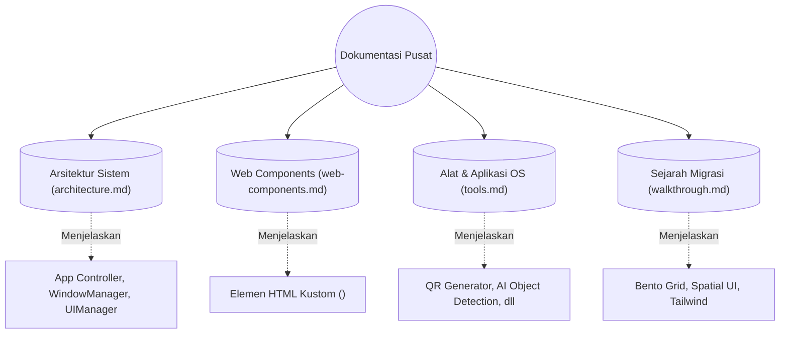
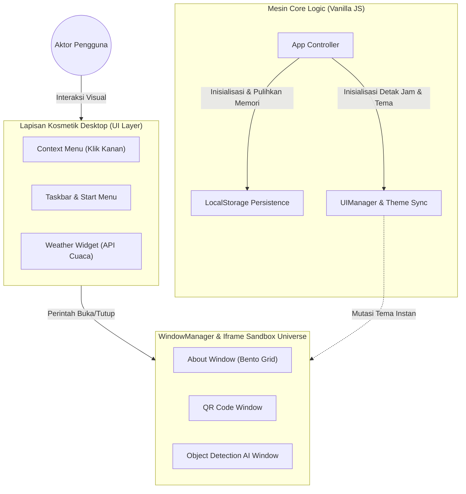

# Dokumentasi AuthntcG Web OS

Selamat datang di pusat dokumentasi untuk **AuthntcG Portfolio Website**. Proyek ini mendobrak batas konsep *resume* statis dengan menghadirkan pengalaman sejati **Web OS (Operating System di dalam peramban)**. Sistem operasi peramban ini dibangun mutlak menggunakan tumpukan teknologi asli tanpa kerangka kerja raksasa!

---

## 1. Topologi Dokumen Induk

Di bawah ini adalah peta hierarki navigasi (*Sitemap*) yang memandu Anda menjelajahi lautan kode dan konseptual arsitektur proyek ini:

Gunakan tautan cepat berikut untuk terjun ke dalam spesifikasi teknis:
- [Arsitektur Sistem (architecture.md)](./architecture.md) - Penjelasan rinci tentang module pengontrol OS.
- [Web Components (web-components.md)](./web-components.md) - Bedah anatomi kustom elemen HTML, proteksi Iframe Shield, dan Z-Index management.
- [Alat / Tools (tools.md)](./tools.md) - Dokumentasi sub-aplikasi yang terisolasi di dalam Iframe OS (Termasuk kalkulasi spasial TensorFlow).
- [Walkthrough (walkthrough.md)](./walkthrough.md) - Rangkuman teknis migrasi sejarah (Dari Bootstrap ke Spatial Tailwind OS).

---

## 2. Gambaran Besar Arsitektur (High-Level Topology)

Berikut adalah bagan topologi interaksi tingkat tertinggi, menunjukkan batasan absolut (*Sandboxing*) antara Logika Inti, Lapisan Kosmetik Desktop, dan Alam Semesta Aplikasi:

Melalui desain infrastruktur **Iframe Sandboxing Universe**, *Web OS* ini tidak akan pernah hancur meskipun aplikasi internal yang dimuat di dalamnya (`QR Code` atau `AI Object Detection`) mengalami gagal skrip parsial!
