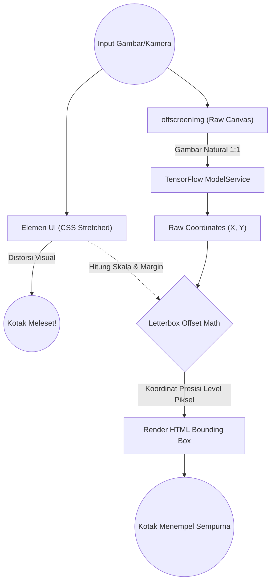
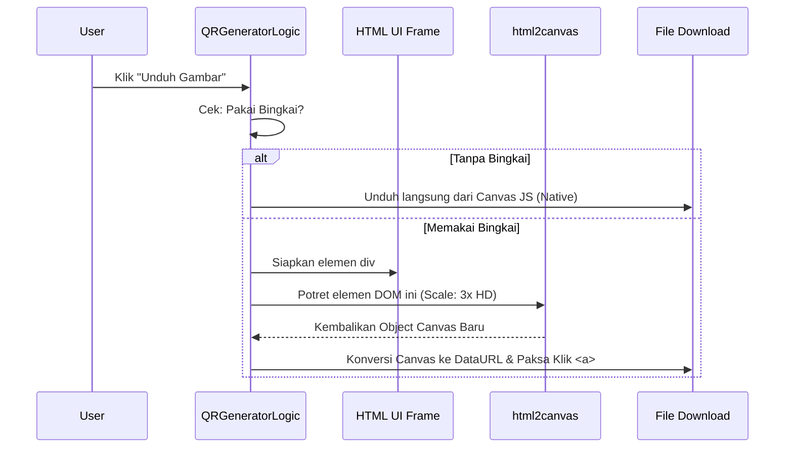
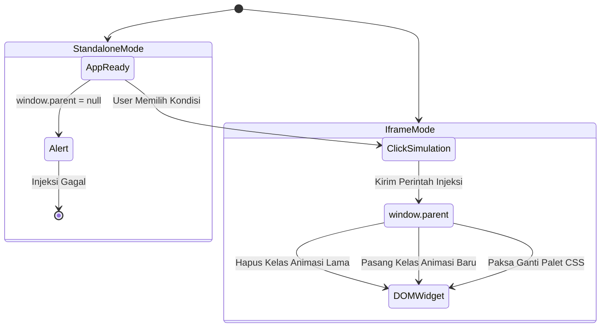

# Dokumentasi Alat (Tools & Sub-Projects)

Semua aplikasi (Tools) pada OS ini dienkapsulasi dengan ketat di dalam `/project/`. Mereka beroperasi sepenuhnya terpisah dari sistem inti berkat keajaiban **Iframe Sandboxing Architecture**. 

---

## 1. Pustaka AI Object Detection (`project/object-detection`)

Sebuah mahakarya *Computer Vision* yang membawa kecerdasan buatan langsung ke dalam peramban (*Client-Side Edge Computing*) melalui **TensorFlow.js**.

### A. Alur Kerja Deteksi & Offset Math (TensorFlow Letterboxing Fix)

Masalah terbesar saat menggunakan model AI pada UI responsif adalah distorsi elemen `<video>` atau ``. Saat menggunakan CSS `object-fit: contain`, media visual sering memiliki ruang kosong (Letterbox). TensorFlow membaca ruang kosong ini sebagai bagian dari gambar, menyebabkan kotak deteksi meleset jauh dari target!

**Penjelasan Algoritma:**
1. OS sengaja tidak menyuapi `HTMLImageElement` yang ada di layar ke dalam fungsi `tf.browser.fromPixels()`.
2. OS menciptakan *Canvas/Image bayangan* (Offscreen) yang berukuran sama persis dengan aslinya (100% resolusi).
3. Setelah TensorFlow mendeteksi koordinatnya, fungsi *Offset Math* akan melakukan penskalaan perbandingan antara "Resolusi Asli" vs "Ukuran Layar UI Terkini", lalu menambahkan variabel "margin" (kotak hitam layar). Hasilnya? Deteksi sempurna!

### B. Tailwind CSS Cross-Dimensional Theme Sync
Semua gaya gelap (Dark Mode) pada aplikasi ini sepenuhnya sinkron dengan OS Induk. Ini dicapai bukan dengan @media prefers-color-scheme, melainkan dengan 	ailwind.config khusus di dalam blok <head> aplikasi yang memetakan pemantik mode gelap kepada mutasi atribut data-bs-theme="dark" milik OS.

---

## 2. QR Code Generator (`project/qr-code-generator`)

Sebuah generator kode matriks interaktif (Real-time Feedback) yang mendukung penyisipan logo *brand* di tengah matriks, serta opsi kustomisasi batas (*padding*) dan pola sudut.

### A. Strategi Mocked Download (html2canvas)

Tantangan utama dari aplikasi ini adalah fitur penambahan "Bingkai Foto" (Polaroid). Fitur ini dibuat menggunakan DOM HTML biasa, sehingga sistem generator QR bawaan tidak mampu menyimpannya menjadi gambar `png`.

**Penjelasan:**
Saat sakelar diklik, aplikasi memanggil rute handleMenuAction di OS Induk. OS kemudian mengubah temanya sendiri, lalu memaksa penulisan ulang atribut data-bs-theme ke seluruh Iframe. Di dalam jendela *Settings*, sebuah **MutationObserver** tingkat tinggi mengawasi tubuh HTML-nya sendiri. Begitu atributnya diubah oleh "Tangan Tak Terlihat" (OS Induk), sang observer seketika membangunkan fungsi updateToggleUI() sehingga tuas bereaksi tanpa butuh panggilan *PostMessage* yang rumit.
---

## 3. QR Code Generator (`project/qr-code-generator`)

Merupakan pionir dari **Golden Standard UI** pada ekosistem AuthntcG Web OS. Aplikasi utilitas klasik ini telah direkayasa ulang untuk mencerminkan bahasa desain OS yang modern.

### Arsitektur UI (Bento Grid)
- **Fluid Layouts**: Menggunakan kueri kontainer (`@container`) Tailwind CSS yang bereaksi terhadap perubahan dimensi lebar jendela (bukan sekadar lebar monitor pengguna).
- **DOM Independence**: Berjalan di dalam lingkungan iframe yang memiliki cek keamanan `window.self !== window.top` untuk mendeteksi apakah ia sedang dijalankan dalam mode Windowed (membutuhkan background transparan) atau Standalone.

---

## 4. QA Playground (Weather Simulator) (`tools/dev-playground`)

Sistem operasi ini tidak hanya ramah pengguna, tetapi juga dilengkapi alat uji coba perangkat lunak (*Software Testing Tool*) terintegrasi. 

### Cross-Frame Injection & Simulator
Alat ini dibangun dengan struktur *Tab Vanilla JS* untuk memudahkan pengembangan fitur OS baru di masa mendatang tanpa menumpuk kode.

---

## 5. VyloServe Landing Page (`project/vyloserve`)

Sebuah aplikasi presentasi (*Digital Brochure*) mandiri yang dirancang untuk mengatasi limitasi `X-Frame-Options: deny` dari server eksternal seperti GitHub.

### Arsitektur Konten Otonom
- **Native OS Feel**: Dibangun menggunakan *Tailwind CSS* untuk menyajikan fitur (*Smart Dashboard*, *Multi-Engine Database*, *PHP FastCGI*) secara elegan menggunakan *Bento Grid*.
- **Responsive & Seamless**: Dilengkapi dengan logika deteksi `window.self === window.top` untuk memberikan latar belakang transparan saat dibuka dalam modul Iframe OS, menjaga kohesi antarmuka (*UI Cohesion*).
