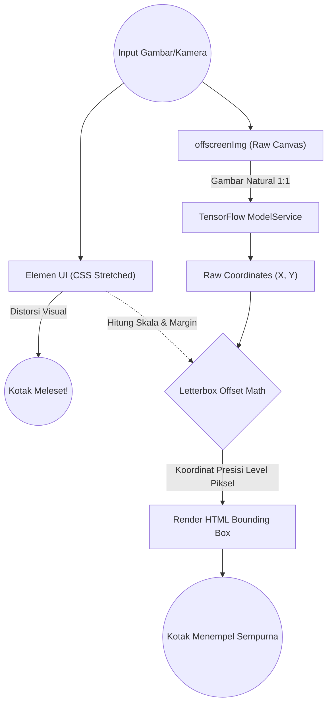
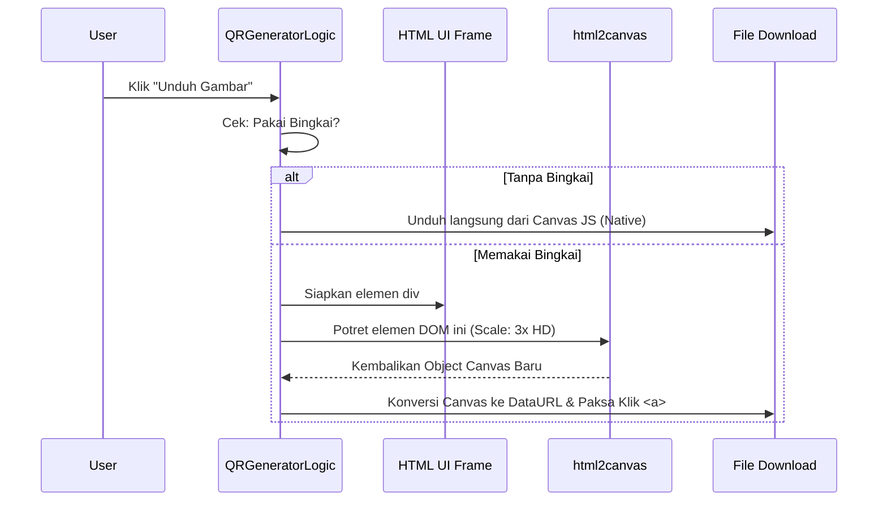
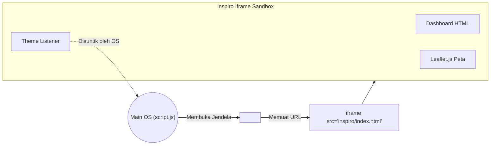

# Dokumentasi Alat (Tools & Sub-Projects)

Semua aplikasi (Tools) pada OS ini dienkapsulasi dengan ketat di dalam `/project/`. Mereka beroperasi sepenuhnya terpisah dari sistem inti berkat keajaiban **Iframe Sandboxing Architecture**. 

---

## 1. Pustaka AI Object Detection (`project/object-detection`)

Sebuah mahakarya *Computer Vision* yang membawa kecerdasan buatan langsung ke dalam peramban (*Client-Side Edge Computing*) melalui **TensorFlow.js**.

### A. Alur Kerja Deteksi & Offset Math (TensorFlow Letterboxing Fix)

Masalah terbesar saat menggunakan model AI pada UI responsif adalah distorsi elemen `<video>` atau ``. Saat menggunakan CSS `object-fit: contain`, media visual sering memiliki ruang kosong (Letterbox). TensorFlow membaca ruang kosong ini sebagai bagian dari gambar, menyebabkan kotak deteksi meleset jauh dari target!

**Penjelasan Algoritma:**
1. OS sengaja tidak menyuapi `HTMLImageElement` yang ada di layar ke dalam fungsi `tf.browser.fromPixels()`.
2. OS menciptakan *Canvas/Image bayangan* (Offscreen) yang berukuran sama persis dengan aslinya (100% resolusi).
3. Setelah TensorFlow mendeteksi koordinatnya, fungsi *Offset Math* akan melakukan penskalaan perbandingan antara "Resolusi Asli" vs "Ukuran Layar UI Terkini", lalu menambahkan variabel "margin" (kotak hitam layar). Hasilnya? Deteksi sempurna!

---

## 2. QR Code Generator (`project/qr-code-generator`)

Sebuah generator kode matriks interaktif (Real-time Feedback) yang mendukung penyisipan logo *brand* di tengah matriks, serta opsi kustomisasi batas (*padding*) dan pola sudut.

### A. Strategi Mocked Download (html2canvas)

Tantangan utama dari aplikasi ini adalah fitur penambahan "Bingkai Foto" (Polaroid). Fitur ini dibuat menggunakan DOM HTML biasa, sehingga sistem generator QR bawaan tidak mampu menyimpannya menjadi gambar `png`.

**Penjelasan:**
Sistem menggunakan modul pembantu eksternal (`html2canvas`) untuk meniru tangkapan layar spesifik pada elemen div bingkai tersebut. Sistem mengaturnya pada skala ketajaman `3x` agar hasil potret DOM tidak terlihat *pixelated* pecah saat dicetak oleh pengguna, menciptakan manipulasi seolah peramban men-*generate* grafis utuh.

---

## 3. Inspiro Dashboard (`project/inspiro`)

Ini adalah aplikasi pertama yang membuktikan kekuatan OS ini dalam memuat Dasbor tingkat-BUMN (berisi sistem grid rumit, Peta interaktif Leaflet.js, dan berbagai widget lainnya) secara mandiri.

Aplikasi ini mencontohkan konsep **Micro-Frontend** murni. Jika kode di dalam Inspiro Dashboard *crash*, maka layar utama (Desktop OS) tidak akan ikut mati atau terkena imbasnya sedikitpun.
