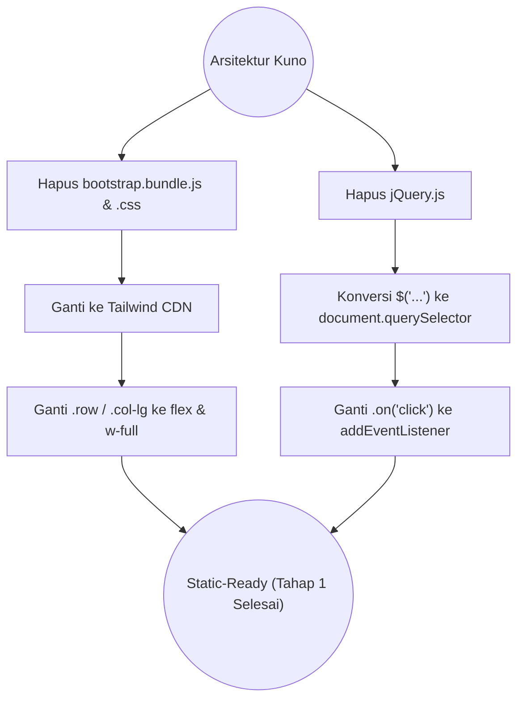
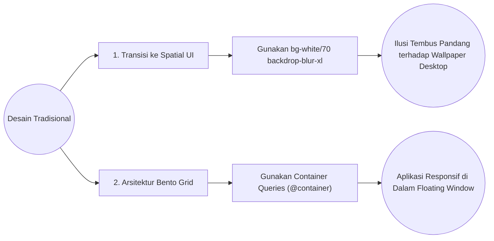
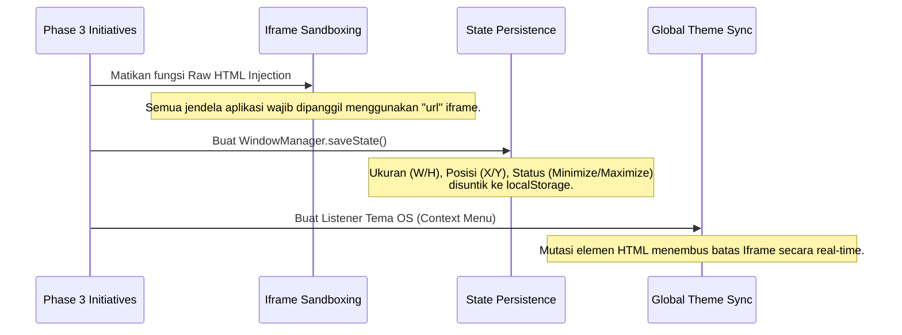
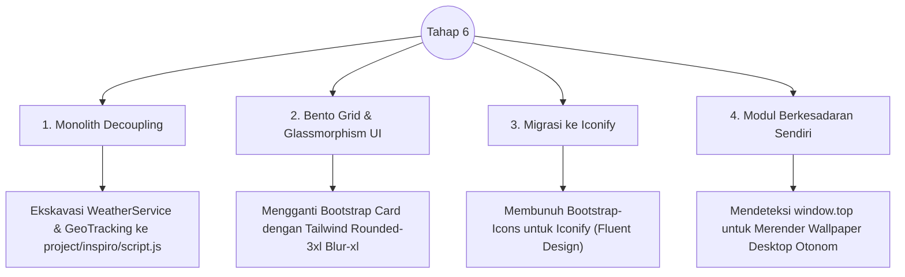

# Rekam Jejak Arsitektur & Migrasi (Walkthrough)

Dokumen ini mencatat titik-titik balik historis dalam perombakan kode (*tech-debt*) sejak awal repositori dibentuk hingga menjadi Web OS modern saat ini.

---

## 1. Migrasi Tailwind CSS & Vanilla JS (Tahap 1)

Repositori ini awalnya dibuat menggunakan arsitektur tradisional: `jQuery`, `Bootstrap 5`, dan injeksi kaku. Semuanya dimusnahkan dalam perombakan pertama ini demi performa ringan.

Semua interaksi seperti perpindahan *tab*, penutupan *modal*, dan geser layar diubah mutlak menggunakan antarmuka DOM asli (*Native Web APIs*).

---

## 2. Revolusi Desain: Bento Grid & Spatial UI (Tahap 2)

Antarmuka dasar datar (*Flat UI*) diratakan ke tanah dan dirombak ulang secara total mengikuti tren antarmuka keruangan Apple/Windows 11 modern.

- **Container Queries (`@container`)**: Resolusi responsif terbesar pada proyek ini. Menggunakan *Media Queries* tradisional (`@media (min-width)`) pada *floating window* adalah kesalahan fatal karena media query mengacu pada layar monitor pengguna. Dengan Container Queries, elemen *Bento Grid* akan menyusut dengan cerdas berdasarkan lebar **Jendelanya Sendiri**, memungkinkannya terlihat rapi bahkan saat jendela aplikasi diperkecil ukurannya oleh kursor pengguna.

---

## 3. Tahap Akhir: Web OS Enhancements (Tahap 3)

Tahap paling kompleks yang menyulap sekadar web portofolio statis, menjadi sebuah tiruan sistem operasi canggih.

## Validasi Keseluruhan (Tujuan Tercapai)
Sistem sekarang:
1. **0% Kebocoran CSS**: Mustahil satu aplikasi (seperti Object Detection) secara tidak sengaja mengacaukan CSS Desktop OS (berkat Iframe Sandbox).
2. **Memori Abadi (Persistence)**: Anda dapat menyusun aplikasi di sudut layar, mengubah temanya, dan melakukan *Refresh (F5)*. Peramban akan mengembalikan OS persis pada tata letak letak mikroskopis piksel Anda yang terakhir!

---

## 4. Penyempurnaan Ekstrem: UI/UX & Clean Code (Tahap 4)

Setelah arsitektur fungsional terwujud, kode dikaji ulang untuk optimalisasi performa tinggi, penghilangan redudansi, dan perbaikan detail antarmuka (Symmetry & Spatial UI).

`mermaid
flowchart TD
    Phase4(("Tahap 4 Refactor")) --> DRY["1. AppRegistry (DRY Code)"]
    Phase4 --> Taskbar["2. Dynamic Taskbar"]
    Phase4 --> UX["3. Symmetrical Start Menu"]
    Phase4 --> Perf["4. Render Debouncing"]
    
    DRY --> Taskbar
    Taskbar --> |"Data-Driven Icons"| AppIcons["Ikon Taskbar Menyesuaikan App"]
    
    UX --> Settings["Settings App (Bento Grid)"]
    Perf --> AI["TensorFlow Resize (requestAnimationFrame)"]
`

**Pencapaian Utama:**
1. **AppRegistry**: Membunuh ratusan baris kode *copy-paste* untuk membuka jendela (openAbout, openQR, dll) menjadi satu sumber kebenaran tunggal (openApp(id)).
2. **Symmetrical Gap Fix**: Perhitungan Flexbox untuk Taskbar memastikan tidak ada jarak atau tiang pembatas yang tersisa saat tidak ada aplikasi yang terbuka.
3. **CPU Throttling (Debouncing)**: *Event Listener* pengubah ukuran kanvas TensorFlow dibungkus oleh 
equestAnimationFrame untuk mencegah ledakan penggunaan CPU saat jendela digeser/diubah ukurannya.
4. **Dynamic Data-Driven Icons**: OS Taskbar kini secerdas Windows 11, membaca properti spesifik dari jendela yang sedang terbuka untuk menampilkan ikon yang akurat.
---

## 5. OS Lifecycle & Resolusi Bug Ekstrim (Tahap 5)

Tahap pemungkas di mana OS diberikan sentuhan realistis siklus hidup sejati (menyala dan mati) serta pembersihan tuntas pada kutu (*bugs*) mikroskopis yang luput dari tahap perombakan UI.

`mermaid
flowchart TD
    Phase5(("Tahap 5")) --> Lifecycle["1. Boot & Lockscreen"]
    Phase5 --> Observers["2. Mutation Observer (Theme Sync)"]
    Phase5 --> BugFix["3. Object Detection Legacy Fix"]
    Phase5 --> Alignment["4. Absolute Positioning Math"]
    
    Lifecycle --> BootManager["Melahirkan BootManager (Terminal + GUI Boot)"]
    Observers --> SettingsUI["Tuas Toggle Settings Otomatis Menggeser"]
    BugFix --> Tailwind["Menyuntikkan konfigurasi Tailwind Dark Mode"]
    Alignment --> PowerMenu["Membungkus Tombol Power agar Menu Tepat Berada di Atasnya"]
`

**Pencapaian Utama:**
1. **Sistem Boot Hibrida**: Menyatukan gaya mesin ketik *Command Line* klasik (lengkap dengan kursor berkedip dan *font* retro) yang perlahan meleleh menjadi transisi *loading* antarmuka GUI modern (seperti MacOS).
2. **Glassmorphism Lockscreen**: Pemusnahan progres pemuatan statis pp-preloader menjadi sebuah layar kunci berkelas dengan balutan kaca setebal lur(25px) untuk menutupi seluruh proses pengunduhan aset dari mata pengguna.
3. **Mekanika Restart/Shutdown yang Realistis**: Menggunakan operasi pembersihan localStorage agar *browser* benar-benar bertingkah seperti mesin yang dimatikan.
4. **Pemusnahan Mutasi Kutu (Bug Annihilation)**: Membersihkan sisa-sisa ID HTML usang pada komponen Video, memastikan sinkronisasi *Tailwind Dark Mode* menyebar tak bersisa ke seluruh sudut *iframe* berkat MutationObserver otonom.

---

## 6. Inspiro Dashboard Revamp & Clean Code Enforcement (Tahap 6)

Pemurnian arsitektur OS yang sebelumnya cacat akibat penumpukan fungsi-fungsi dari *Sub-App* tertentu ke dalam Induk OS. Sekaligus perombakan wajah aplikasi beranda agar selaras dengan desain OS masa depan.

**Pencapaian Utama:**
1. **Pemusnahan "OS di dalam OS"**: Memisahkan secara paksa logika spesifik Inspiro (*Geocoding*, Jam Raksasa, *Weather Fetching*) dari OS Pusat. OS Pusat kini berjalan sangat ringan tanpa *overhead* interval cuaca.
2. **Standardisasi Bento Grid**: Mengubah desain antarmuka *Dashboard* dari bentuk linear tradisional menjadi tumpukan kontainer proporsional bergaya Bento yang dibalut *Glassmorphism* konsisten.
3. **Penyempurnaan Ikonografi**: Menyuntikkan keahlian utilitas yang mengubah kodifikasi cuaca BMKG/Eropa menjadi kode *Fluent Design*, dan menyelesaikan masalah *rendering* Shadow DOM dari *Web Components* `<iconify-icon>`.
4. **Resiliensi Anti-FOUC**: Pemusnahan efek kelap-kelip pergantian tema saat memuat halaman dengan cara menyuntikkan skrip pemblokiran *IIFE (Immediately Invoked Function Expression)* persis di jantung `<head>` dokumen.

---

## 8. Start Menu UI Revamp & Glassmorphism (Fase 8)

Pada fase ini, kami secara agresif merombak antarmuka Start Menu agar sejalan dengan prinsip *Fluent Design* dan tata letak *Windows 11-style*. 

`mermaid
flowchart LR
    StartMenu(("Start Menu Kuno")) --> Action1["Ganti List menjadi Grid (3-Kolom)"]
    StartMenu --> Action2["Implementasi Custom Glass-Scrollbar"]
    StartMenu --> Action3["Reverse Geocoding Cuaca"]
    StartMenu --> Action4["Real-time Search App Filtering"]
    
    Action1 --> Modern["UI Start Menu Baru"]
    Action2 --> Modern
    Action3 --> Modern
    Action4 --> Modern
`

**Poin-Poin Perombakan:**
1. **Search App Filtering**: Pencarian di Start Menu tidak lagi statis. *Event listener* JavaScript di-binding untuk mencari start-app-item dan melakukan penyaringan secara *real-time*.
2. **Reverse Geocoding**: Teks statis dihilangkan; Cuaca kini memanggil API igdatacloud.net untuk menampilkan nama Kota pengguna.
3. **Penyempurnaan Proporsi**: Tata letak *flexbox* distandarisasi menggunakan lex-1 agar Pinned Apps (kiri) dan Widgets (kanan) tidak saling tumpang tindih akibat kalkulasi gap Tailwind. Background box distandarisasi secara simetris, kecuali saat ada instruksi pembukaan asimetris untuk menonjolkan Widget.
4. **Desktop Icon Cleanup**: Ikon aplikasi *Inspiro* direlokasi sepenuhnya dari *Desktop* masuk ke jajaran eksklusif aplikasi *Start Menu*, demi menjaga *desktop* tetap bersih.

## 9. Professional About Page Revamp (Fase 9)

Mengubah total arsitektur halaman bout.html dari yang tadinya bersifat *basic* menjadi sebuah etalase profesional kelas kakap yang dioptimasi khusus untuk *Recruiter* (HR) dan *Tech Leads*. 

`mermaid
flowchart LR
    About(("about.html Kuno")) --> Ext["Ekstraksi Data CV (PDF)"]
    Ext --> Layout["Perombakan Bento Grid (4 Blok)"]
    Layout --> UI["Injeksi Glassmorphism & F-Pattern Scanning"]
    UI --> Final["Profil Profesional Bebas AI-Slop"]
`

**Poin-Poin Perombakan:**
1. **F-Pattern Scanning & Progressive Disclosure**: Menyusun struktur visual berdasar pergerakan mata natural. Informasi kritikal (Peran saat ini, Eksekutif Summary) berada di atas kiri, sedangkan detail teknis disembunyikan dalam wujud *timeline* dan *badges* yang mudah di-skan.
2. **Professional Copywriting**: Mencabut bahasa artifisial bergaya *AI Slop* yang klise, lalu memformulasikan ulang menggunakan metrik profesional yang berbobot: "Software Engineer", "Cloud Data Migration", "Enterprise-scale Platforms", dengan mencatut klien-klien kakap (Telkom Indonesia, HM Sampoerna).
3. **Glassmorphism Timeline**: Mengubah daftar riwayat pekerjaan menjadi garis waktu vertikal (*timeline*) yang mulus, responsif, dan dibalut latar belakang transparan khas estetika Web OS ini.

## 10. Settings App Revamp & Personalisasi (Fase 10)

Memperbarui struktur aplikasi project/settings/index.html menjadi interaktif dan menambah fungsionalitas kustomisasi tanpa merusak layout.

**Fitur Baru:**
1. **Navigasi Tab Interaktif**: Beralih antara menu *Personalization* dan *About System* secara instan.
2. **About System Panel**: Menampilkan versi OS dan deskripsi teknis (*Vanilla JS*, *Tailwind*).
3. **Toggle Format Jam**: Penambahan sakelar untuk mengubah format waktu (*12-Hour vs 24-Hour*). Logika *rendering* di OS Root (script.js) dirombak agar seketika merespons perubahan dari localStorage('authntcg-clock-24h') pada Taskbar dan Lock Screen.

## 11. QR Code Generator Revamp (Fase 11)

Membersihkan *tech-debt* peninggalan Bootstrap kuno dan menyesuaikan total antarmuka ke dalam bahasa desain *Glassmorphism Bento Grid*.

**Optimalisasi Struktural:**
1. **Tailwind Migration**: Logika JavaScript pada qr-generator.js yang bertugas me-render form dinamis (seperti form Wi-Fi) telah ditulis ulang menggunakan kelas Tailwind (grid-cols-2, ackdrop-blur-md, input-mica), menyingkirkan kelas orm-control Bootstrap.
2. **Environment Checking (Wallpaper)**: Skrip latar belakang kini hanya akan mengunduh dan memasang *wallpaper* jika dibuka secara *standalone* (window.self === window.top). Jika dibuka di dalam Web OS, proses *rendering background* dilewati agar transparan.
3. **Background Color Picker**: Penambahan pemilih warna latar (*Warna Latar*) yang disinkronisasikan ke pustaka *qr-code-styling*. Tombol "Back to Home" juga disembunyikan saat aplikasi berjalan di dalam *window*.

## 12. UI Alignment (Golden Standard) pada QR Code Generator (Fase 12)

Melakukan *fine-tuning* pada UI/UX QR Code Generator untuk menyamai *Golden Standard* yang terdapat pada halaman object-detection.

**Perubahan Kosmetik Signifikan:**
1. **Unified Title Pill**: Mengubah gaya judul <h4> kuno menjadi *Pill* judul (seperti lencana) menggunakan *backdrop-blur* dan kelas radius tinggi (mirip gaya header Object Detection).
2. **Bento Box Shadows & Borders**: Menyesuaikan kelas pembungkus alat (*container tools*) agar persis menggunakan proporsi dan warna dari *Object Detection*: 
ounded-3xl shadow-sm border-gray-200/60 bg-white/70 backdrop-blur-xl p-5.
3. **Tipografi & Ikon**: Menyeragamkan seluruh sub-judul menjadi kapitalisasi kecil tebal (	ext-xs font-bold text-gray-400 uppercase tracking-widest) dan mengonversi ikon lawas *Bootstrap Icons* menjadi *Fluent Iconify Icons* modern.
4. **Gradient Buttons & Scrollbar**: Menggunakan kustomisasi *scrollbar* khusus dan mengubah tombol unduh (ekspor) menjadi *gradient blue* elegan yang reaktif saat ditekan. 

## 13. Resolusi Bug pada QR Code Generator (Fase 13)

Menindaklanjuti transisi penuh ke *Golden Standard UI*, dilakukan perbaikan teknis mendalam terhadap 6 *bug* dan cacat *rendering* yang terjadi akibat terlepasnya style.css global:
1. **QR Cut-off Fix**: Mengembalikan CSS responsif (max-width: 100%; height: auto;) untuk elemen canvas yang di-render oleh pustaka *qr-code-styling*, sehingga QR proporsional dan tidak terpotong pada kotak pratinjau.
2. **Textarea Dark Mode**: Menyesuaikan kotak *Raw Output Data* agar menggunakan kelas dark:bg-gray-800/50 backdrop-blur-md, menghilangkan *bug* tampilan latar putih yang menyilaukan saat mode gelap.
3. **Background Color Input Box**: Mengubah tata letak pemilih "Warna Latar" menjadi merentang penuh (*full width* 100%) dengan bantalan khusus (h-10 p-1) agar terlihat konsisten seperti baris *input* modern lainnya, bukan setengah grid.
4. **Frame Styles Recovery**: Menginjeksi kembali seluruh spesifikasi kelas bingkai hiasan dekoratif (.frame-scan-me, .frame-polaroid, .frame-modern) langsung ke dalam blok <style> lokal agar opsi *Gaya Bingkai* dapat beroperasi secara normal tanpa bergantung pada CSS lawas OS.
5. **Color Reactivity Logic**: Mengaitkan nilai dari elemen qr-bg-color ke dalam konfigurasi ackgroundOptions: { color: ... } di dalam fungsi utama pembangun mesin (engine) *updateUI* agar *real-time*.
6. **Logo Disappear Bug**: Memperbaiki variabel *state* penyimpanan 	his.currentLogo di dalam ssets/script/js/qr-generator.js yang sebelumnya hanya memperbarui tampilan visual, tetapi tidak menyimpan *string DataURL* logonya, menyebabkan logo terhapus saat *slider* ukuran logo digeser.

## 14. Penyempurnaan Tata Letak & FOUC pada Object Detection (Fase 14)

Melakukan serangkaian perbaikan teknis pada sub-aplikasi **Object Detection** untuk menyempurnakan perilaku layar dan menghilangkan gangguan visual saat *loading*.

**Perbaikan yang Diterapkan:**
1. **Dynamic Background Logic**: Menulis ulang fungsi ThemeService.initDynamicBackground() agar cerdas mengenali lingkungan berjalannya aplikasi. Jika berada di dalam *Windowed Mode* (OS Iframe), *wallpaper* tidak akan diunduh dan layar dijadikan transparan (g-transparent), memperlihatkan *wallpaper* OS di belakangnya. Wallpaper khusus baru diunduh ketika diakses secara *Standalone*.
2. **Height & Flexbox Overhaul**: Merombak struktur penampung utama dengan konfigurasi h-screen flex flex-col pada <body> dan lex-grow overflow-y-auto w-full pada kontainer dalam, sehingga tampilan proporsional mengisi 100% ketinggian layar dan menggulung mulus (*scroll*) ke bawah dengan *padding* simetris (p-4 @lg:p-6).
3. **FOUC Glitch Fix (Anti-Berkedip)**: Menyuntikkan skrip pemblokiran sinkronus (*IIFE blocker*) tepat di dalam blok <head> untuk mendikte atribut data-bs-theme ke elemen <html> sebelum <body> dirender, mengeliminasi kedipan (*flash*) dari putih ke gelap (FOUC).
4. **Preloader Visibility**: Menambahkan *Tailwind CDN Fallback CSS* di dalam <head> yang secara instan menghitamkan layar *preload* dan mengubah teks menjadi putih pada mode gelap, sehingga teks *Loading Model...* tidak akan pernah hilang atau tidak terbaca akibat keterlambatan *parsing* mesin *Tailwind CDN*.

5. **Camera Aspect Ratio Fix**: Memperbaiki masalah pemotongan rasio (*cropping*) pada mode Live Webcam dengan mengganti kelas CSS object-cover menjadi object-contain. Algoritma perhitungan skala *bounding box* pada *canvas* di script.js (Renderer.drawPredictions) juga disesuaikan untuk secara dinamis menggunakan rumus matematis *letterboxing*, sehingga kamera kini selalu menampilkan rasio asli (*native ratio*) secara utuh tanpa ada area sudut yang terbuang.

## 15. Pemusnahan Masal Glitch FOUC (Fase 15)

Melakukan *smoke-test* dan perbaikan serentak (*mass-patching*) untuk membasmi *Flash of Unstyled Content* (FOUC) pada sisa sub-aplikasi lainnya di ekosistem OS.

**Aplikasi yang Ditambal:**
1. project/qr-code-generator/index.html
2. project/settings/index.html
3. bout.html

**Tindakan yang Diambil:**
Menginjeksi *IIFE Blocker Script* (skrip pencegat sinkronus) tepat di dalam blok <head>. Skrip ini berfungsi membaca nilai tema dari localStorage atau preferensi sistem, lalu menyuntikkan atribut data-bs-theme ke elemen <html lang="en"> dalam hitungan milidetik sebelum DOM peramban selesai merender isi <body>. Ini memastikan pustaka *Tailwind CDN* langsung merender gaya warna yang tepat tanpa pernah memperlihatkan bingkai putih sesaat. Pada QR Generator, ditambahkan juga *CSS Fallback* untuk tabir *preloader* agar hitam absolut selama proses *parsing* jaringan CDN berlangsung.

## 16. Penyelesaian Hasil Smoke-Test (Fase 16)

Menyelesaikan berbagai laporan *glitch* minor dan *enhancement* visual pasca uji coba (*smoke-test*) pada ekosistem OS:

**Penyempurnaan Antarmuka (UI Polish):**
1. **Penyelarasan Toggle Switch (Settings)**: Memperbaiki inkonsistensi warna tombol sakelar (*toggle*) di pengaturan. Logika manipulasi kelas (DOM) dikalibrasi agar status nonaktif selalu konsisten menggunakan kombinasi g-gray-200 dark:bg-gray-600 untuk mengatasi bentrokan prioritas kelas Tailwind CSS.
2. **Widget Cuaca Dinamis (Start Menu)**: Menyuntikkan pemetaan palet warna *gradient* (linear-gradient) ke dalam koleksi data Utils.getWeatherMeta. Kini kotak widget cuaca tidak lagi statis berwarna biru, melainkan akan merespons warna cuaca dunia nyata (misal: biru-cyan untuk cerah, dan gradasi abu-abu gelap untuk badai).
3. **Glitch Separator Taskbar**: Mencabut kelas hidden secara permanen pada pemisah garis tegak lurus (|) pertama di samping tombol *Start*. Langkah ini mengunci tata letak pembatas agar susunan Start | Ikon App | Jam tidak lagi menyatu saat aplikasi sedang berjalan.
4. **Visibilitas Tombol Power**: Mengganti warna *icon* Power di *Start Menu* dari warna abu-abu samar (	ext-gray-500) menjadi warna peringatan (	ext-red-500 dark:text-red-400) agar jauh lebih mencolok sebagai fungsi krusial sistem.
5. **Konsistensi Akun Pengguna**: Melakukan penyesuaian teks statis dari "authntcg" menjadi "AuthntcG!" pada halaman akun di Settings agar selaras 100% dengan teks pembuka yang ada pada Start Menu OS.

## 17. Hardware-Accelerated Weather Animations (Fase 17)

Menindaklanjuti penyempurnaan widget cuaca, dilakukan implementasi lapisan animasi visual berkinerja tinggi (*High-Performance Micro-Interactions*) untuk memberikan pengalaman layaknya sistem operasi *native*.

**Metode Rekayasa Ringan (Pure CSS & SVG):**
Ketimbang menggunakan *JavaScript RequestAnimationFrame* atau <canvas> yang dapat menyedot tenaga CPU dan baterai, animasi dibangun 100% menggunakan algoritma GPU-accelerated:
1. **SVG Tiling via Pseudo-Elements**: Pola cuaca (awan, titik hujan, petir) ditulis langsung menggunakan string data:image/svg+xml super ringan yang dirender ke dalam elemen gaib ::before dan ::after milik pembungkus widget cuaca.
2. **CSS Keyframes**: Empat kelas cuaca utama diciptakan:
   - .weather-anim-sun: Menghembuskan pendaran (*glowing pulse*) radial di sudut layar.
   - .weather-anim-clouds: Menggeser vektor awan transparan secara horizontal (*infinite slide*).
   - .weather-anim-rain: Menjatuhkan pola garis hujan vertikal.
   - .weather-anim-storm: Mengkombinasikan hujan badai dengan kedipan kilat putih (manipulasi opacity asinkronus).
3. **Dynamic Binding**: Modul utils.js (pada getWeatherMeta) dimodifikasi untuk melampirkan *property* nim yang kemudian disuntikkan secara dinamis oleh script.js sesuai kode standar meteorologi BMKG.

Hasilnya, widget cuaca kini beranimasi dengan kecepatan 60FPS murni melalui *Compositor Thread* (GPU), mempertahankan prinsip OS yang *ultra-lightweight*.

## 18. Hotfix: Resolusi Specificity CSS pada Animasi Hujan (Fase 18)

Menindaklanjuti laporan *smoke-test* terkait hilangnya rintik hujan pada mode badai (*storm*), dilakukan investigasi pada lapisan CSS mesin animasi.

**Penyebab Glitch (Root Cause):**
Terjadi bentrokan bobot hirarki (*CSS Specificity*). Pengaturan visibilitas dasar disematkan pada ID #weather-widget-card::before (mewajibkan opacity: 0). Sementara pemicu animasi hujan hanya menggunakan *class selector* .weather-anim-storm::before (meminta opacity: 1). Berdasarkan hukum hirarki CSS, *ID selector* memiliki bobot lebih absolut dibandingkan *Class selector*, sehingga perintah opacity: 1 ditolak oleh peramban dan hujan menjadi tak kasat mata (transparan). Kilatan petir tetap terlihat karena ia menggunakan elemen ::after yang tidak berbenturan dengan pengunci ID utama.

**Solusi yang Diterapkan:**
Meningkatkan bobot hierarki pemanggilan gaya animasi dengan menggabungkan ID dan *Class selector* secara berantai (contoh: #weather-widget-card.weather-anim-storm::before). Dengan bobot yang lebih tinggi, perintah visibilitas animasi kini berhasil membobol nilai dasar transparan, sehingga rintik badai dapat dirender berdampingan dengan kilatan petir secara sempurna.

## 19. Penyempurnaan Vektor Hujan Diagonal (Fase 19)

Merespons ulasan terkait animasi rintik hujan yang terlihat kaku dan sintetis (garis lurus, tebal, dan sejajar sempurna), dilakukan desain ulang arsitektur *Scalable Vector Graphics* (SVG) untuk menampilkan fenomena hujan yang jauh lebih organik.

**Perubahan Arsitektur Visual:**
1. **Micro-Variance Angles**: Mengganti pola garis tegak lurus menjadi pola SVG 200x200 piksel kustom yang memuat 8 tetesan berbeda. Masing-masing tetesan memiliki koordinat kemiringan (*tilt angle*) yang sengaja disimpangkan sebesar 1 hingga 3 derajat (x1 vs x2).
2. **Diagonal Transform**: Menambahkan algoritma 
otate(-20deg) pada siklus *keyframes CSS*, yang secara global memutar sumbu gravitasi sehingga arah jatuhnya rintik (*translateY*) menyapu menyilang dari pojok kanan atas menuju kiri bawah tanpa memutar tampilan *widget* itu sendiri.
3. **Dimensi Asimetris**: Variasi *stroke-width* ditetapkan pada spektrum ekstrem sangat tipis (.4 hingga 1.2) serta memangkas intensitas warna menjadi sangat transparan (
gba(255,255,255,0.15)), membedakannya secara tegas dari teks putih sehingga menciptakan kedalaman visual (ilusi *depth of field*).

## 20. Ekstensi Alat Pengujian: Weather Simulator (Fase 20)

Untuk mempermudah pengujian QA (*Quality Assurance*) pada sistem *widget* cuaca tanpa harus bergantung pada API BMKG *real-time*, diciptakan sub-aplikasi internal bernama **Weather Simulator** (win-weather-tester).

**Fitur & Arsitektur Simulator:**
1. **Injeksi Lintas-Frame (*Cross-Frame Injection*)**: Alat uji ini dikemas dalam bentuk aplikasi jendela layaknya ekosistem OS lainnya. Ia bekerja dengan mengakses konteks DOM induk (OS Utama) melalui objek window.parent, sehingga dapat memaksa perubahan cuaca di Desktop secara langsung tanpa harus melakukan simulasi API *mocking* yang rumit.
2. **Preset 4 Kondisi Mayor**:
   - **Cerah**: Memicu Utils.getWeatherMeta(0) (Animasi Matahari).
   - **Berawan**: Memicu kode 2 (Animasi Awan Bergeser).
   - **Hujan**: Memicu kode 61 (Animasi Rintik Diagonal).
   - **Badai**: Memicu kode 95 (Kombinasi Rintik Badai & Kilatan Petir).
3. **Fungsi Pemulihan (*Reset*)**: Tombol "Kembalikan ke Cuaca Asli" memicu window.parent.UIManager.setupWeather() untuk mengembalikan wewenang ke sistem API *geolocation* dan membersihkan status simulasi.

Simulator ini telah didaftarkan ke AppRegistry dan disematkan langsung di dalam kisi (*grid*) aplikasi pada **Start Menu** untuk kemudahan akses saat pengembangan berlanjut.

## 21. Resolusi Registri Aplikasi & Ekspansi QA Playground (Fase 21)

Merespons kendala terkait ikon Start Menu yang tidak muncul dan jendela Simulator yang gagal terbuka.

**Penyelesaian *Bugs*:**
1. **Kegagalan AppRegistry**: Skrip injeksi sebelumnya gagal meregistrasikan rute aplikasi karena ketidakcocokan *string* ID di script.js. Hal ini memutus siklus pemanggilan dari UI WindowManager.openApp. Masalah ini telah diperbaiki dengan merestrukturisasi objek AppRegistry yang benar.
2. **Koreksi Ikon Pustaka**: Mengganti ikon rujukan ke luent:beaker-24-filled yang dijamin keberadaannya pada *Content Delivery Network* (CDN) pustaka Iconify. Label di Start Menu turut disesuaikan menjadi "Playground".

**Ekspansi Fitur (The Tabbed QA Playground):**
Sub-aplikasi ini telah didesain ulang total untuk mengakomodasi rencana jangka panjang. 
- Struktur *Single-Page* dirombak menjadi **Sistem Tab Vanilla JS**.
- Tab 1 ("Weather") difokuskan murni untuk simulasi status cuaca.
- Tab 2 ("Fitur Baru") telah disiapkan sebagai ruang hampa yang akan diisi dengan modul uji coba (QA) setiap kali sebuah arsitektur baru dikembangkan di masa depan.
- Aturan pengecekan *Environment* (if window.self === window.top) turut ditegakkan agar Playground tidak menampilkan layar putih saat dipaksa buka secara mandiri tanpa bingkai OS.

## 22. Hotfix: Resolusi Ketergantungan Modul Playground (Fase 22)

Menindaklanjuti laporan kegagalan fungsi injeksi *Weather Simulator* yang memunculkan peringatan sistem saat dijalankan di dalam lingkungan OS.

**Penyebab Kegagalan (Root Cause):**
Skrip simulator mencoba memanggil fungsi pemetaan cuaca melalui objek window.parent.Utils. Namun, dalam arsitektur keamanan *JavaScript Modern (ES6 Modules)*, fungsi Utils yang diimpor ke dalam script.js terisolasi di dalam *Module Scope* (tidak diekspos ke objek global window). Akibatnya, window.parent.Utils mengembalikan nilai undefined, yang mana langsung memicu peringatan *fallback* kegagalan injeksi.

**Solusi yang Diterapkan:**
1. **Bypass Ketergantungan Modul**: Modul getWeatherMeta telah diduplikasi secara lokal ke dalam project/weather-tester/index.html. Dengan demikian, *Playground* dapat beroperasi secara otonom tanpa harus mengakses modul tertutup milik OS, dan dapat langsung melakukan manipulasi DOM pada widget cuaca (window.parent.document.getElementById('weather-widget-card')).
2. **Koreksi Fungsi Reset**: Tombol pengembalian sistem cuaca kini diarahkan pada fungsi yang terekspos secara global secara benar, yakni window.parent.DesktopUI.startGeoTracking(), sehingga *widget* akan memuat ulang GPS dan API BMKG secara instan.

## 23. Hotfix: CSS Display Override Bug pada Playground (Fase 23)

Menindaklanjuti laporan kebocoran tampilan UI di mana teks "Modul Pengujian Belum Tersedia" dari Tab 2 secara tidak sengaja muncul di bawah kendali cuaca pada Tab 1.

**Penyebab Kegagalan (Root Cause):**
Terjadi bentrokan prioritas spesifisitas CSS (CSS Specificity) antara *Utility Class* Tailwind dan CSS kustom.
Tab 2 secara statis diberikan kelas lex oleh Tailwind (.flex { display: flex; }). Tailwind CDN selalu menyuntikkan *stylesheet*-nya di urutan paling akhir pada elemen <head>. Akibatnya, kelas .flex menimpa (override) gaya .tab-content { display: none; } yang telah didefinisikan sebelumnya di dalam blok <style> lokal. Ini menyebabkan Tab 2 gagal disembunyikan (*display: none* diabaikan) dan terus-menerus dirender di bawah Tab 1.

**Solusi yang Diterapkan:**
1. **Pencabutan Kelas Statis**: Kelas lex, lex-col, items-center, dan justify-center dihapus dari deklarasi HTML Tab 2 agar kelas .tab-content { display: none; } dapat bekerja tanpa hambatan.
2. **Injeksi Gaya Dinamis**: Properti *flexbox* tersebut dipindahkan ke dalam blok CSS lokal khusus untuk kondisi aktif (#tab-coming-soon.active { display: flex; ... }), sehingga tata letak *flex* hanya berlaku ketika tab benar-benar sedang dibuka. Teks *placeholder* juga telah dikembalikan ke kalimat aslinya.

## 24. Dokumentasi Komprehensif (Fase Final)

Mempersiapkan penggabungan kode (*Merge Request*) ke percabangan utama (main) dengan melakukan standardisasi, audit kelengkapan fungsionalitas, dan memperbarui seluruh manuskrip arsitektur pada direktori /docs.

**Langkah Audit & Dokumentasi:**
1. **README.md**: Ditulis ulang dari awal untuk mendeskripsikan OS secara keseluruhan (Web OS, Tech Stack Vanilla JS, dan Fitur Edge AI).
2. **architecture.md**: Ditambahkan spesifikasi mendalam (disertai diagram alur Mermaid) mengenai "Zero-JS GPU Compositing" pada animasi cuaca, dan pola "Cross-Frame DOM Hijacking" pada sistem QA Playground.
3. **tools.md**: Diperluas dengan penambahan dokumentasi arsitektur Bento Grid pada QR Code Generator, serta *State Diagram* lintas-bingkai dari aplikasi QA Playground.

OS kini telah berhasil mencapai stabilitas fungsionalitas dan visual (*Golden Standard UI*) secara menyeluruh pada semua lapis ekosistemnya.

## 25. Final Polish & Reorganisasi Struktur Folder (Fase 25)

Melakukan pembersihan (*cleanup*) dan restrukturisasi direktori sebelum tahap produksi akhir untuk memastikan bahwa hierarki folder mencerminkan filosofi arsitektur dengan tepat.

**Langkah Pembersihan:**
1. **Garbage Collection**: Melakukan pencarian dan penghapusan permanen terhadap sisa-sisa *file* pengujian selama fase *development* (seperti 	est_geo.js, 	est_rain.html, dan old_script.js).
2. **Reorganisasi Modul Sistem**: 
   - Direktori project/settings dipindahkan ke 	ools/settings.
   - Modul pengujian dipindahkan dari project/weather-tester dan diganti namanya menjadi 	ools/dev-playground agar terdengar lebih universal sebagai alat pengembangan sistem (bukan bagian dari proyek portofolio murni pengguna).
3. **Pembaruan Referensi Core OS**: ID Registri aplikasi dikoreksi dari win-weather-tester menjadi win-dev-playground pada ssets/script/js/script.js. Tautan pemicu pada *Start Menu* (index.html) juga telah direkayasa ulang untuk mengarah ke ID dan URL baru ini.
4. **Pembaruan Dokumentasi**: Referensi path di docs/architecture.md dan docs/tools.md telah disinkronkan dengan struktur /tools yang baru.

Repositori kini berada dalam kondisi absolut bersih, terstruktur rapi, dan siap untuk dilebur (*Merge*) ke *branch main*!

## 26. Minor Enhancement: Vyloserve Link Standardization (Fase 26)

Melakukan penyesuaian (*enhancement*) minor pada halaman "About" untuk menyelaraskan perilaku antarmuka (UI) dari tautan proyek Vyloserve.

**Perubahan yang Dilakukan:**
1. **Standardisasi Label Tombol**: Mengubah teks tombol dari "View on GitHub" menjadi "Visit Page" agar seragam secara leksikal dengan seluruh tombol proyek lainnya (Inspiro, Object Detection, QR Gen).
2. **Standardisasi Perilaku Jendela**: 
   - Proyek Vyloserve secara resmi diregistrasikan ke dalam OS AppRegistry dengan ID win-vyloserve.
   - Mengubah pemicu tombol dari window.open (tab browser eksternal) menjadi window.parent.WindowManager.openApp('win-vyloserve'). Kini, tautan GitHub Vyloserve akan mencoba dirender di dalam ekosistem jendela OS secara mulus layaknya sub-aplikasi lainnya.

## 27. Minor Enhancement: Vyloserve Native Landing Page (Fase 27)

Sebagai respon terhadap isu pemblokiran Iframe oleh kebijakan keamanan GitHub (X-Frame-Options: deny), tautan Vyloserve tidak lagi diarahkan ke situs GitHub secara langsung dari dalam OS Window.

**Pembuatan Landing Page Lokal:**
1. **Ekstraksi Data Terstruktur**: Melakukan penarikan informasi (Tech Stack, Key Features, Architecture) langsung dari dokumen eksternal README.md dan docs/index.md milik repositori Vyloserve asli.
2. **Desain UI Native (/project/vyloserve)**: Membangun halaman mendarat (*Landing Page*) lokal yang memanfaatkan *Tailwind CSS*, elemen *Glassmorphism* (Bento Grid), dan integrasi ikon yang seragam dengan OS. Halaman ini juga memiliki lapisan latar belakang transparan saat dibuka dalam mode jendela (*Windowed Mode*).
3. **Re-routing AppRegistry**: Registrasi rute win-vyloserve kini diarahkan ke halaman lokal /project/vyloserve/index.html. Pengguna kini dapat membaca seluruh fitur aplikasi Vyloserve dengan nyaman di dalam ekosistem OS, dan tersedia tombol *Visit Repository* khusus jika pengguna ingin melompat ke halaman GitHub asli (di tab terpisah).
