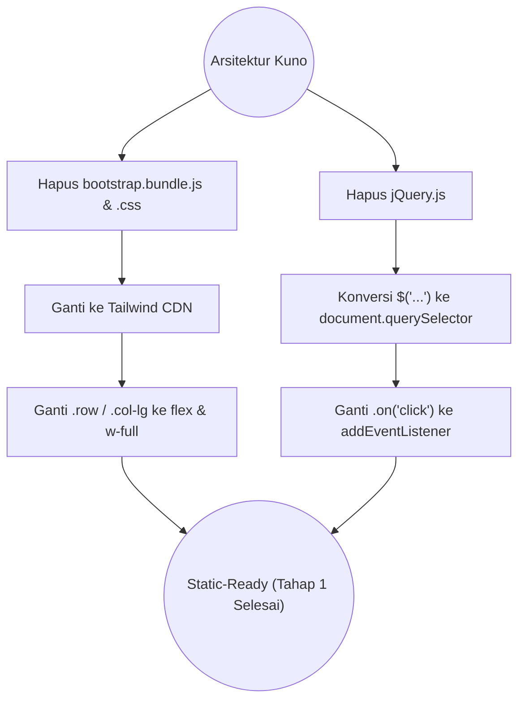
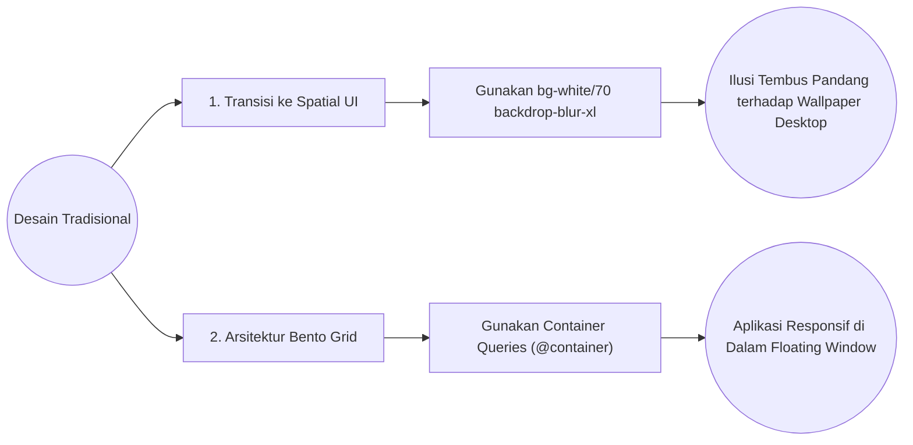
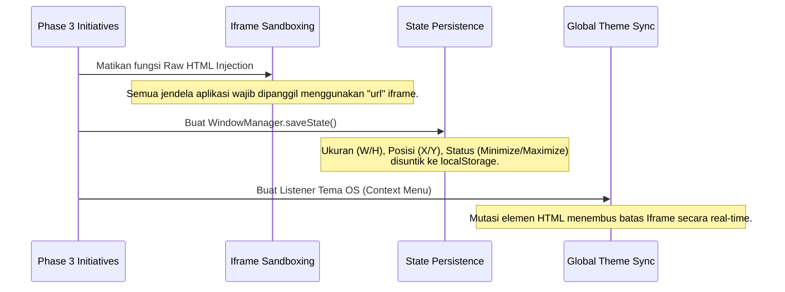

# Rekam Jejak Arsitektur & Migrasi (Walkthrough)

Dokumen ini mencatat titik-titik balik historis dalam perombakan kode (*tech-debt*) sejak awal repositori dibentuk hingga menjadi Web OS modern saat ini.

---

## 1. Migrasi Tailwind CSS & Vanilla JS (Tahap 1)

Repositori ini awalnya dibuat menggunakan arsitektur tradisional: `jQuery`, `Bootstrap 5`, dan injeksi kaku. Semuanya dimusnahkan dalam perombakan pertama ini demi performa ringan.

Semua interaksi seperti perpindahan *tab*, penutupan *modal*, dan geser layar diubah mutlak menggunakan antarmuka DOM asli (*Native Web APIs*).

---

## 2. Revolusi Desain: Bento Grid & Spatial UI (Tahap 2)

Antarmuka dasar datar (*Flat UI*) diratakan ke tanah dan dirombak ulang secara total mengikuti tren antarmuka keruangan Apple/Windows 11 modern.

- **Container Queries (`@container`)**: Resolusi responsif terbesar pada proyek ini. Menggunakan *Media Queries* tradisional (`@media (min-width)`) pada *floating window* adalah kesalahan fatal karena media query mengacu pada layar monitor pengguna. Dengan Container Queries, elemen *Bento Grid* akan menyusut dengan cerdas berdasarkan lebar **Jendelanya Sendiri**, memungkinkannya terlihat rapi bahkan saat jendela aplikasi diperkecil ukurannya oleh kursor pengguna.

---

## 3. Tahap Akhir: Web OS Enhancements (Tahap 3)

Tahap paling kompleks yang menyulap sekadar web portofolio statis, menjadi sebuah tiruan sistem operasi canggih.

## Validasi Keseluruhan (Tujuan Tercapai)
Sistem sekarang:
1. **0% Kebocoran CSS**: Mustahil satu aplikasi (seperti Object Detection) secara tidak sengaja mengacaukan CSS Desktop OS (berkat Iframe Sandbox).
2. **Memori Abadi (Persistence)**: Anda dapat menyusun aplikasi di sudut layar, mengubah temanya, dan melakukan *Refresh (F5)*. Peramban akan mengembalikan OS persis pada tata letak letak mikroskopis piksel Anda yang terakhir!
