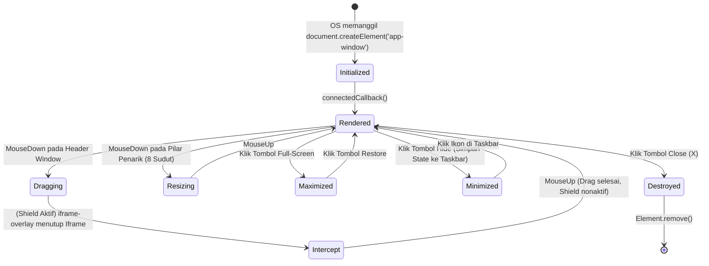
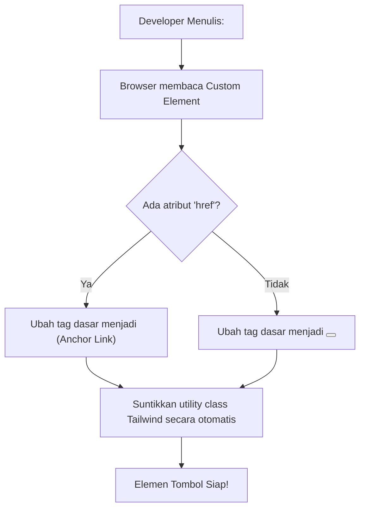
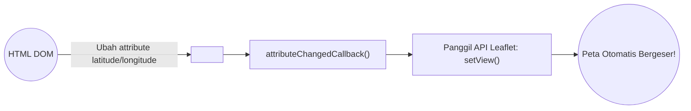

# Web Components (Custom Elements)

Proyek ini dibangun tanpa kerangka kerja besar (tanpa React, tanpa Vue, tanpa Angular). Untuk memodularisasi UI yang kompleks, proyek memanfaatkan spesifikasi masa depan W3C, yaitu **Vanilla Custom Elements**.

---

## 1. `<app-window>` (Window System Inti)

Ini adalah komponen mutlak (*backbone*) dari OS. Komponen ini diciptakan murni dari ekstensi `HTMLElement`.

### A. Lifecycle & State Management

Jendela operasi di OS ini bukan elemen statis. Ia bereaksi terhadap sentuhan, interaksi kursor, dan perintah OS.

### B. Mekanisme Keamanan: Iframe Overlay (Kursor Ditelan Iframe)
Saat Anda mencoba menggeser elemen jendela (`Dragging`), kursor peramban seringkali tanpa sengaja "terpeleset" masuk melintasi wilayah Iframe (contoh: halaman QR Code). Secara otomatis, peramban akan memindahkan kewenangan klik (*events*) kursor tersebut ke dalam Iframe, membuat OS Induk kehilangan *track* terhadap pergerakan kursor Anda (Jendela akan berhenti terseret padahal kursor masih ditekan).

**Solusi Atomik:** 
`<app-window>` memiliki `iframe-overlay` (sebuah div transparan *display:none*). Saat fungsi `Dragging` atau `Resizing` dimulai, div ini diaktifkan (`display:block`) tepat di atas iframe, menjadi "Perisai Kaca" yang akan mencegah kursor Anda menyentuh Iframe selama proses pergerakan jendela!

---

## 2. Sintaks Pintar: `<app-button>` & `<app-taskbar-btn>`

Menggunakan komponen kustom sangat membantu dalam menyingkirkan pengulangan sintaks kelas (*class*) Tailwind yang tidak terhingga panjangnya.

### Alur Mutasi Pintar `<app-button>`

**Penjelasan:**
Saat Anda menggunakan Bootstrap di masa lalu, setiap tag tombol mengharuskan Anda menulis `btn btn-primary btn-sm...`. Dengan `<app-button>`, Anda cukup mendeklarasikan propertinya, dan komponen secara dinamis merender dirinya sendiri menjadi elemen hipertaut atau tombol sejati yang kompatibel secara aksesibilitas!

---

## 3. `<app-map>` (Leaflet Auto-Renderer)

Elemen peta ini mereduksi ratusan baris penyiapan *Library* Leaflet.js menjadi hanya 1 baris HTML.

Fitur reaktif pada `attributeChangedCallback` memungkinkan pengembang menggeser posisi *marker* peta hanya dengan memanipulasi HTML dari luar, tanpa menyentuh *instance* Leaflet secara langsung.
